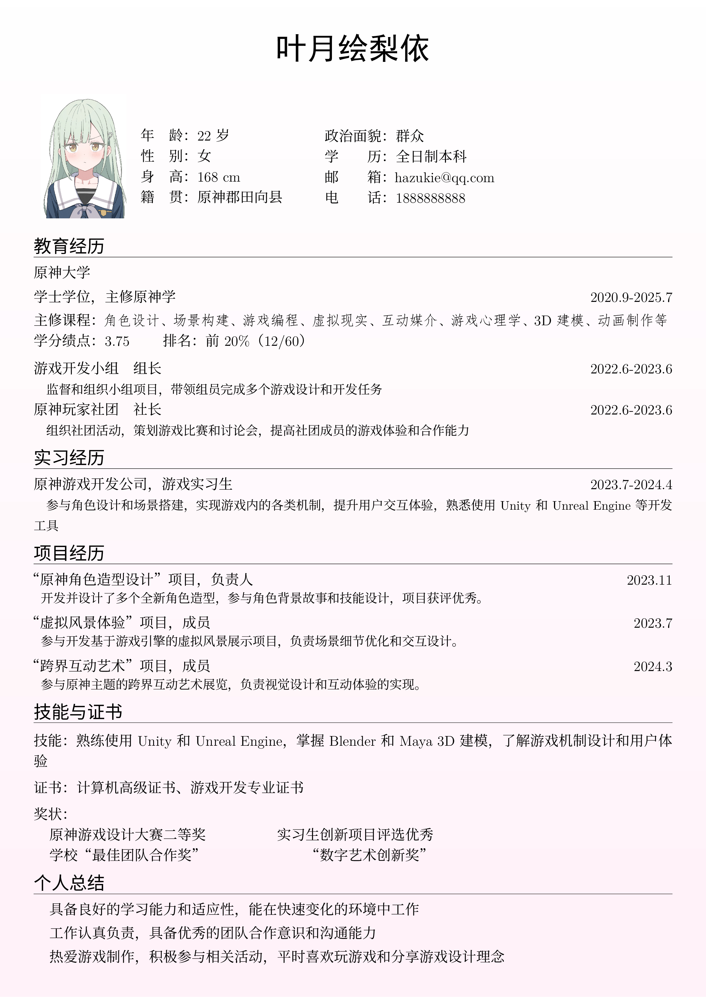
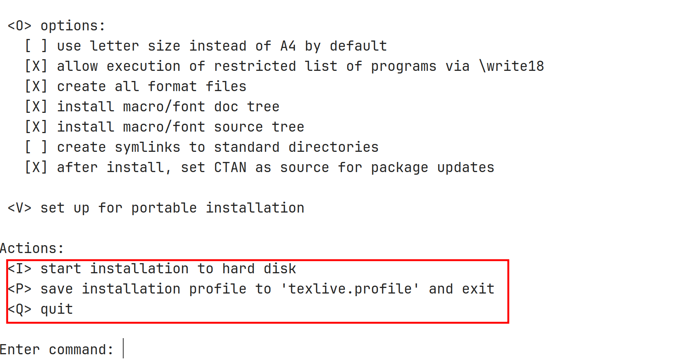
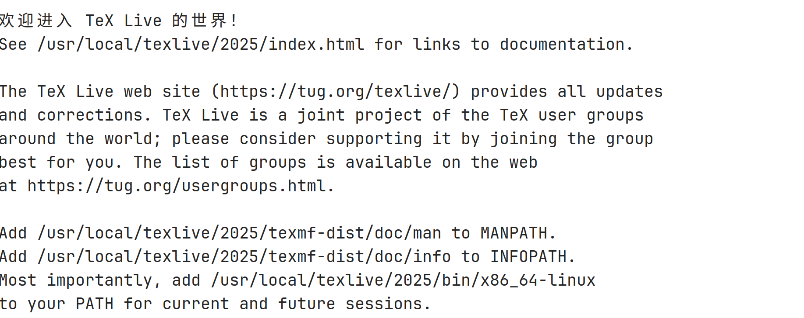

# 简易简历模板 LaTeX 教程

---
## 简历预览




## 快速入门

### 项目简介

模板在制作过程中，借鉴了以下 GitHub 项目:

- [awesome-resume, @dyweb](https://github.com/dyweb/awesome-resume-for-chinese)
- [Deedy-Resume-for-Chinese, @dyweb](https://github.com/dyweb/Deedy-Resume-for-Chinese)
- [cv-resume, @geekplux](https://github.com/geekplux/cv_resume)
- [resume, @billryan](https://github.com/billryan/resume)
- [resume, @hijiangtao](https://github.com/hijiangtao/resume)

在这些简历的基础上，编写了符合个人风格的简历模板。模板布局主要参考自 **billryan** 的排版样式，版块分布则参照了学院简历书写规范及上述项目简历内容。通过查阅 LaTeX 文档及互联网问答论坛（如知乎、StackExchange 等），经过 3 天的时间，编辑出了令自己较为满意的 LaTeX 模板。

该模板致力于：

- 提供基本信息控制，通过修改基本信息实现快速魔改
- 关注内容，而非格式。时间应花费在内容编排
- 提供 Makefile 编译，支持生成附件(奖状证件)的信息索引，方便内容迁移

### 项目缘起

由于大四实习前制作的简历，太过简陋，加之实习那年 11 月签了某单位后，就将找工作的简历丢之角落尘封许久。实习结束后，因家中变故及个人对于医院的反感情绪影响，做出了“短浅”的决定——即解除相关合同。于是，自己不得不找工作，重拾了简历后才始知当年制作水准有多么一言难尽。将就着向其他行业投了几十份简历，杳无音信后，察觉简历内容和形式或是影响找工作的因素之一，自己就有了重制的打算。加之，自己在五六月份赶论文期间积累了不少排版心得。趁着赋闲在家，边学习 LaTeX 基本语法，边着手简历重制工作。

### 开始使用

**前期准备**

由于模板基于 LaTeX 编写，所以要求计算机上安装有 TeX 且配置相关环境变量。注意：若想使用附件索引生成功能，**请务必安装有支持 Posix 规范的终端模拟器**。目前相关脚本暂无支持 Windows 的批处理脚本。

以下是项目完全运行的最小依赖（推荐）：

- TexLive2025
- Make(4.3)
- Bash

---

**Windows 安装建议**

- TexLive: 下载 [TexLive ISO光盘](https://mirrors.tuna.tsinghua.edu.cn/CTAN/systems/texlive/Images/texlive2025-20250308.iso)，双击文件，找到 `install-tl-windows.bat`，按照提示安装，在 cmd 上输入 `tex -v` 后输出版本信息则证明安装成功
- [Cygwin](https://www.cygwin.com/setup-x86_64.exe): 一款支持 Posix规范的终端，安装时可选 make。安装教程可参考[这篇文章](https://zhuanlan.zhihu.com/p/474242350)。

---

**Ubuntu 安装建议**

- TexLive: 下载 [TexLive ISO光盘](https://mirrors.tuna.tsinghua.edu.cn/CTAN/systems/texlive/Images/texlive2025-20250308.iso)

为方便安装，推荐在终端环境下操作。

假设 ISO光盘路径：**/home/ubuntu/texlive2025.iso**

将其挂载到 /mnt 目录：

```bash
sudo mount -o loop /home/ubuntu/texlive2025.iso /mnt
```

然后跳转到 /mnt 目录，并运行安装脚本：

```bash
cd /mnt
sudo ./install-tl
```



请仔细查阅提示，输入 **I** 后回车安装。

安装后输出信息包含有环境变量，请暂时记住，后面配置要用到。

移除 ISO光盘挂载：

```bash
sudo umount /mnt
```



并将环境变量（如上图）添加到 .bashrc 或 .zshrc 中。环境变量添加操作请自行检索。

至此 TexLive 安装完成。

- 安装 make 库：

```bash
sudo apt install make
make -v # 检验是否安装成功：输出版本信息
```

---

**下载项目代码**

- 可以通过点击项目右侧 **Release**，找到压缩包后点击下载
- 通过终端 git 远程拉取代码：

```bash
git clone xxxxx # 请打开 bash/powershell 等, 输入此条指令
```

---

**编译模板**

手动下载者解压后，需在当前文件夹内打开终端：

```bash
make # 编译输出PDF文件
```

---

**查看 PDF 文件**

编译完成后，当前文件夹下会产生一个 PDF 文件。你可以使用阅读器进行查看——Ubuntu 可使用系统内置的 Evince，Windows 可用 Edge 打开。

### Makefile 编译选项

```bash
使用说明:
make              编译 PDF 文件
make all          等同于 'make'
make collect      插入汇总奖状附件信息，按新到旧顺序排列
make rcollect     插入汇总奖状附件信息，按旧到新顺序排列
make ncollect     按附件文中出现顺序排列
make restore      删除自动插入的内容(可手动在 tex 文件中删除)
make clean        清理编译生成的临时文件
make help         显示此帮助信息
```

---

### 许可证 License

Apache 2.0 协议开源，图片资源、字体部分详见其对应开源协议。**仅用于教育学习目的，不得作为商业用途。**


### 详细文档，请查看 [说明书.pdf](./说明书.pdf)
